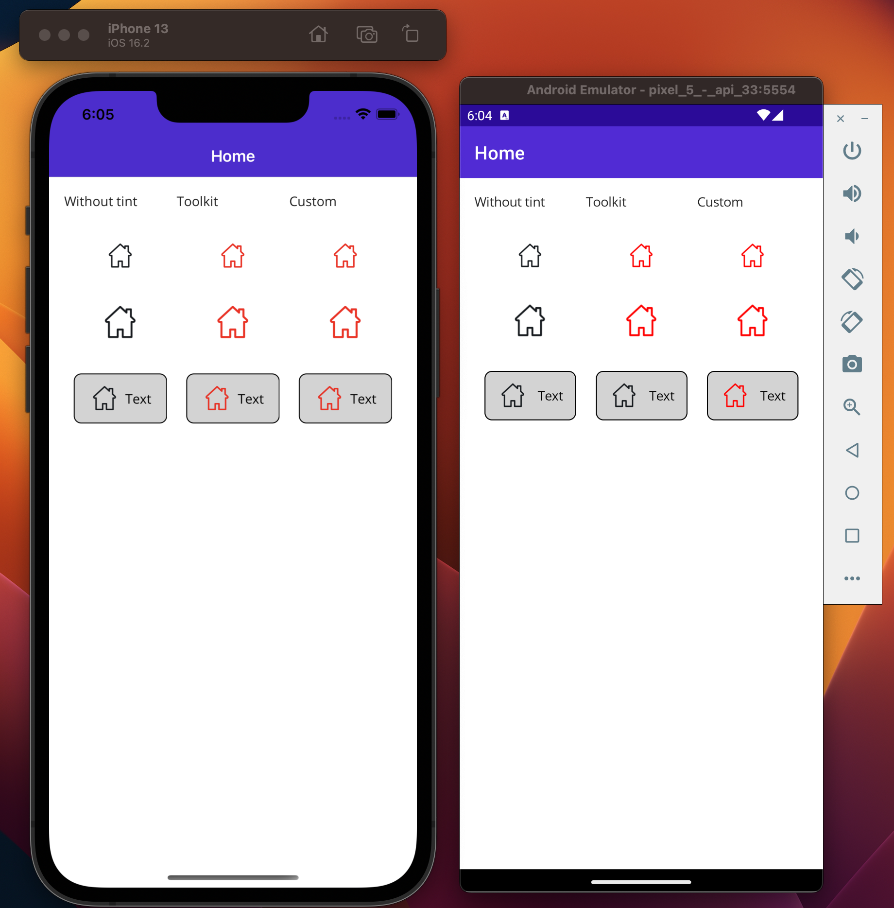

# IconTintColorBehavior for `<Button>` on Android

IconTintColorBehavior from [MAUI Community Toolkit](https://learn.microsoft.com/en-us/dotnet/communitytoolkit/maui/behaviors/icon-tint-color-behavior)
adds a tint color to `<Image>` and `<ImageButton>` on iOS and Android. The behaviour also works for images in `<Button>` (added by the ImageSource property) on iOS but not on Android. This repo contains a copy of IconTintColorBehavior with a fix for Android. 

Second column in the screenshot below shows behaviour using [MAUI Community Toolkit version](https://github.com/CommunityToolkit/Maui/blob/main/src/CommunityToolkit.Maui/Behaviors/PlatformBehaviors/IconTintColor/IconTintColorBehavior.android.cs)   and third column uses [Behaviors/IconTintColorBehavior.android.cs](./Behaviors/IconTintColorBehavior.android.cs) in this repo.

